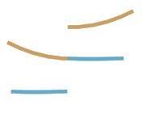

## Tigmint

### Correct Misassemblies Using Linked Reads From Large Molecules

**Shaun Jackman** [\@sjackman][]

Benjamin P Vandervalk, Rene L Warren, Hamid Mohamadi, Justin Chu, Sarah Yeo, Lauren Coombe, Joerg Bohlmann, Steven JM Jones, Inanc Birol

| ISMB HiTSeq 2017-07-25
| <https://sjackman.ca/tigmint-slides>
| [][cc-by]

[\@sjackman]: http://twitter.com/sjackman
[cc-by]: http://creativecommons.org/licenses/by/4.0/

## Shaun Jackman

| [BCCA Genome Sciences Centre][]
| Vancouver, Canada
| [\@sjackman][] &middot; [github.com/sjackman][] &middot; [sjackman.ca][]

[BCCA Genome Sciences Centre]: http://bcgsc.ca
[github.com/sjackman]: https://github.com/sjackman
[sjackman.ca]: http://sjackman.ca

----------------------------------------

----------------------------------------

<aside class="notes">
+ Large molecules of DNA (100 kbp and up) are isolated in partitions
+ Each partition has its own barcode
+ Reads from the same molecule share the same barcode
+ One nanogram of input DNA with 10x Genomics Chromium
</aside>

## Linked Reads

+ Call variants in repetitive regions
+ Identify structural variants
+ Phase variants

## Tools for Linked Reads

### 10x Genomics

[Long Ranger][] &middot; [Supernova][]

### Structural Variants

[GROC-SVs][] &middot; [Topsorter][]

### Scaffolding

[ARCS][] &middot; [Architect][] &middot; [Fragscaff][]

<aside class="notes">
+ [Architect][] intended for synthetic long reads
+ [Fragscaff][] intended for contiguity-preserving transposition
+ [Topsorter][] requires a VCF file
</aside>

----------------------------------------

<aside class="notes">
+ One sequencing library
+ Scaffold over gaps and repeats
+ Local assembly of gaps and repeats
+ Identify and correct misassemblies
</aside>

## Contigs and scaffolds come to an end due to...

+ repeats
+ sequencing gaps
+ heterozygous variation
+ misassemblies

## Misassemblies limit contiguity

particularly for highly contiguous assemblies.

Most scaffolding algorithms address repeats and gaps, but not misassemblies.

----------------------------------------

----------------------------------------

----------------------------------------

## Tigmint

+ Count molecules that support and refute each position of the assembly
+ Output positions of possible misassemblies

----------------------------------------

+ Regions with poor molecule depth are suspect
+ Clipped read alignments at molecule ends \
  pinpoint the position of the breakpoint
+ Highlight possible misassemblies

----------------------------------------

----------------------------------------

## Menagerie of Misassemblies

+ **Chimeric sequence**
+ **Missing sequence** (deletion)
+ Chimeric insertion
+ Inversion
+ Collapsed repeat

----------------------------------------

----------------------------------------

----------------------------------------

## Human Assembly

+ Assemble paired-end/mate-pair with ABySS 2.0
+ Correct misassemblies with 10x Chromium
+ Assembly locus discordant with both the linked reads and the reference is likely a misassembly
+ Tigmint identified 39 breakpoints
+ 38 of 39 (97%) discordant with the reference

## Sitka Spruce Mitochondrion

## Sitka Spruce Mitochondrion

### Before and After Tigmint

N50 improved nine fold from 0.46 Mbp to 4.2 Mbp

<aside class="notes">
+ Assembled organelles from WGSS \
  with ABySS 2.0, ARCS, and Tigmint
+ 6 Mbp mitochondrial genome in 4 scaffolds > 50 kbp
+ Nine fold improvement in N50
+ 70% of genome in one 4.2 Mbp scaffold

| Tools        | Scaffolds | N50      |
|--------------|-----------|----------|
| ABySS + ARCS | 16        | 0.46 Mbp |
| + Tigmint    | 4         | 4.2 Mbp  |

</aside>

fin
================================================================================

## Shaun Jackman

| [BCCA Genome Sciences Centre][]
| Vancouver, Canada
| [\@sjackman][] &middot; [github.com/sjackman][] &middot; [sjackman.ca][]

**Tigmint** \
<https://github.com/bcgsc/tigmint>

**Slides** \
<https://sjackman.ca/tigmint-slides>

**Markdown source code** \
<https://github.com/sjackman/tigmint-slides>

## Links

[ABySS][]
&middot; [ARCS][]
&middot; [Architect][]
&middot; [Fragscaff][]
&middot; [GROC-SVs][]
&middot; [LINKS][]
&middot; [Long Ranger][]
&middot; [MAKER][]
&middot; [Pilon][]
&middot; [Prokka][]
&middot; [Sealer][]
&middot; [Supernova][]
&middot; [Tigmint][]
&middot; [Topsorter][]

[ABySS]: https://github.com/bcgsc/abyss
[ARCS]: https://github.com/bcgsc/arcs
[Architect]: https://github.com/kuleshov/architect
[Fragscaff]: http://krishna.gs.washington.edu/software.html
[GROC-SVs]: https://github.com/grocsvs/grocsvs
[LINKS]: https://github.com/warrenlr/LINKS
[Long Ranger]: https://support.10xgenomics.com/genome-exome/software/pipelines/latest/what-is-long-ranger
[MAKER]: http://www.yandell-lab.org/software/maker.html
[Pilon]: http://www.broadinstitute.org/software/pilon/
[Prokka]: http://www.vicbioinformatics.com/software.prokka.shtml
[Sealer]: https://github.com/bcgsc/abyss/tree/master/Sealer
[Supernova]: http://support.10xgenomics.com/de-novo-assembly/software/overview/welcome
[Tigmint]: https://github.com/bcgsc/tigmint
[Topsorter]: https://github.com/hanfang/Topsorter

Supplementary Slides
================================================================================

## Linked reads

+ Large molecules of DNA (100 kbp and up) are isolated in partitions
+ Each partition has its own barcode
+ Reads from the same molecule share the same barcode
+ One nanogram of input DNA with 10x Genomics Chromium

## Scaffold with ARCS

+ Map the reads to the assembly
+ Identify scaffold ends sharing common barcodes
+ Construct a graph
+ Each edge connects two scaffold ends
+ Merge unambiguous paths through this graph

ARCS: Assembly Roundup by Chromium Scaffolding \
bioRxiv: <https://doi.org/10.1101/100750>

----------------------------------------

----------------------------------------

## Visualization

+ Graph of 10 kbp segments sharing barcodes
+ Scatter plot of molecule start and end position
+ Physical molecule coverage
+ Histogram of clipped read alignments at molecule ends
+ Highlight breakpoints (or putative misassemblies)

----------------------------------------

----------------------------------------

## Human Assemblies

| Assembly               | Tigmint breaks | Discordant breaks | Breaks before | Breaks after     |
|------------------------|----------------|-------------------|---------------|------------------|
| ABySS                  | 39             | 38 (97%)          | 2717          | 2679             |
| ABySS + Bionano + ARCS | 78             | 14 (18%)          | 2757          | 2743             |
| Supernova              | 163            | 56 (34%)          | 3883          | 3827             |

Genome in a Bottle HG004

## Genome Skimming

Assemble the 6 Mbp Sitka spruce mitochondrion

+ Whole genome sequencing data contains both nuclear and organellar reads
+ Hundreds of mitochondria and plastids per cell
+ Reads of the organellar genomes are abundant
+ Organellar genomes assemble with a single lane
+ Single-copy nuclear sequences are too low depth to assemble well

----------------------------------------

## Method

+ Assemble the reads with [ABySS 2.0][ABySS]
+ Correct misassemblies with [Tigmint][]
+ Scaffold with [ARCS][] and [LINKS][]
+ Fill gaps with [Sealer][]
+ Polish with [Pilon][]
+ Annotate genes with [MAKER][] and [Prokka][]

## Sitka Spruce Mitochondrion

+ Assembled organelles from WGSS \
  with ABySS 2.0, ARCS, and Tigmint
+ 6 Mbp mitochondrial genome in 4 scaffolds
+ Nine fold improvement in N50
+ 70% of genome in one 4.2 Mbp scaffold

| Tools        | Scaffolds | N50      |
|--------------|-----------|----------|
| ABySS + ARCS | 16        | 0.46 Mbp |
| + Tigmint    | 4         | 4.2 Mbp  |

----------------------------------------

----------------------------------------

----------------------------------------

| Read Metrics                    | Plastid         | Mitochondrion
|---------------------------------|-----------------|--------------
| Number of HiSeq lanes           | 1 GemCode lane  | 1 Chromium lane
| Read length                     | 2 x 125 bp      | 2 x 150 bp
| Number of read                  | 630 million     | 843 million
| Number selected for assembly    | 4.3 million     | 119 million
| Number mapped to assembly       | 15,232 of 4.3 M | 3.78 M of 843 M
| Proportion of organellar reads  | 1/283 0.35%     | 1/223 or 0.45%
| Depth of coverage               | 17x             | 40x

----------------------------------------

| Assembly Metrics                | Plastid         | Mitochondrion
|---------------------------------|-----------------|--------------
| Assembled genome size           | 124,029 bp      | 6.09 Mbp
| Number of contigs               | 1 contig        | 1,216 contigs
| Contig N50                      | 124 kbp         | 13.7 kbp
| Number of scaffolds             | 1 scaffold      | 239 scaffolds
| Scaffold N50                    | 124 kbp         | 461 kbp
| Largest scaffold                | 124 kbp         | 1,223 kbp
| GC content                      | 38.8%           | 43.6%

----------------------------------------

| Annotation Metrics          | Plastid   | Mitochondrion
|-----------------------------|-----------|--------------
| Number of genes w/o ORFS    | 114 (108) | 115 (67)
| Protein-coding genes (mRNA) | 74 (72)   | 84 (47)
| rRNA genes                  | 4 (4)     | 3 (2)
| tRNA genes                  | 36 (32)   | 25 (18)
| ORFs ≥ 300 bp               | 4         | 1,154
| Introns in coding genes     | 9 (8)     | 9 (6)
| Introns in tRNA genes       | 6 (6)     | 0
