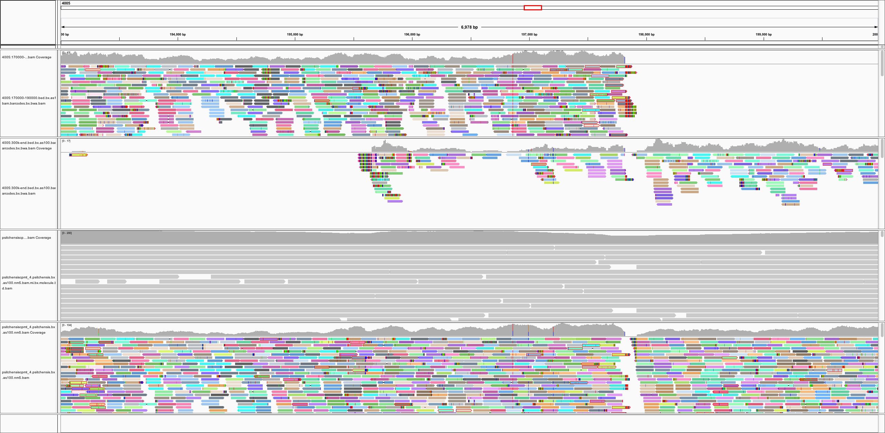

## Tigmint

### Correct Misassemblies Using Linked Reads From Large Molecules

**Shaun Jackman** [\@sjackman][]

Benjamin P Vandervalk, Rene L Warren, Hamid Mohamadi, Justin Chu, Sarah Yeo, Lauren Coombe, Joerg Bohlmann, Steven JM Jones, Inanc Birol

ISMB HiTSeq 2017-07-24&mdash;25

<https://sjackman.ca/tigmint-slides>

[][cc-by]

[\@sjackman]: http://twitter.com/sjackman
[cc-by]: http://creativecommons.org/licenses/by/4.0/

## Shaun Jackman

| [BCCA Genome Sciences Centre][]
| Vancouver, Canada
| [\@sjackman][] | [github.com/sjackman][] | [sjackman.ca][]

[BCCA Genome Sciences Centre]: http://bcgsc.ca
[github.com/sjackman]: https://github.com/sjackman
[sjackman.ca]: http://sjackman.ca

## Linked reads

+ Large molecules of DNA are isolated in partitions
+ Construct barcoded reads from HMW DNA
+ Each partition has its own barcode
+ Reads from the same molecule \
  share the same barcode
+ Large molecules include 100 kbp and up
+ One nanogram of input DNA \
  with 10x Genomics Chromium

----------------------------------------

## Utility to Alignment

+ Identify structural variants
+ Phase variants across large haplotype blocks
+ Map reads to large repeats and resolve ambiguous alignments (MAPQ=0)

## Utility to Assembly

+ One linked-read library rather than paired-end and mate-pair libraries
+ Resolve repeats with local assembly, \
  similar to phasing alleles
+ **Scaffold** over unresolved repeats
+ **Scaffold** over coverages gaps in sequencing \
  caused by for example GC bias
+ **Identify and correct misassemblies**

## Scaffold with ARCS

+ Map the reads to the assembly
+ Identify scaffold ends sharing common barcodes
+ Construct a graph
+ Each edge connects two scaffold ends
+ Merge unambiguous paths through this graph

ARCS: Assembly Roundup by Chromium Scaffolding \
bioRxiv: <https://doi.org/10.1101/100750>

----------------------------------------

## Misassemblies limit contiguity

Contigs and scaffolds come to an end due to...

+ repeats
+ sequencing gaps
+ heterozygous variation
+ misassemblies

**Misassemblies limit scaffold contiguity** \
for highly contiguous assemblies. \
Most scaffolding algorithms address repeats and gaps, but not misassemblies.

## Tigmint

+ Count molecules supporting and refuting each position of the assembly
+ Output positions of assembly breakpoints, \
  putative misassemblies

### Visualize

+ Plot molecule support metrics and breakpoints
+ Graph of 10 kbp segments that share barcodes
+ Colour each segment by its scaffold of origin

----------------------------------------

## Visualization

+ Graph of 10 kbp segments sharing barcodes
+ Scatter plot of molecule start and end position
+ Physical molecule coverage
+ Histogram of clipped read alignments at molecule ends
+ Highlight breakpoints (or putative misassemblies)

----------------------------------------

## Identify and fix misassemblies

+ Regions with poor molecule coverage \
  are suspect
+ Depth less than median minus two times the IQR
+ Refine misassembly coordinates \
  with base-pair accuracy
+ Use clipped read alignments at molecule ends

## Menagerie of Misassemblies

+ **Chimeric fusion**
+ Chimeric insertion
+ Inversion
+ Collapsed non-tandem repeat
+ Missing sequence: \
  scaffold gap, deletion, \
  collapsed tandem repeat

----------------------------------------

----------------------------------------

## Human assembly

+ Genome in a Bottle HG004
+ Assemble paired-end/mate-pair with ABySS 2.0
+ Correct misassemblies with Tigmint using 10x Chromium linked reads
+ Identified 39 breakpoints
+ Assembly discordant with the linked reads and the reference: likely misassembly
+ 38 of 39 breakpoints discordant with reference
+ Precision is 97%
+ Measuring sensitivity is more difficult

## Sitka Spruce Mitochondrion

+ Assembled organelles from WGSS \
  with ABySS 2.0, ARCS, and Tigmint
+ 6 Mbp mitochondrial genome in 4 scaffolds
+ Nine fold improvement in N50
+ 70% of genome in one 4.2 Mbp scaffold

| Tools        | Scaffolds | N50      |
|--------------|-----------|----------|
| ABySS + ARCS | 16        | 0.46 Mbp |
| + Tigmint    | 4         | 4.2 Mbp  |

----------------------------------------

fin
================================================================================

## Shaun Jackman

| [BCCA Genome Sciences Centre][]
| Vancouver, Canada
| [\@sjackman][] | [github.com/sjackman][] | [sjackman.ca][]

**Slides** \
<https://sjackman.ca/tigmint-slides>

**Markdown source code** \
<https://github.com/sjackman/tigmint-slides>

## Links

[ABySS][]
&middot; [ARCS][]
&middot; [LINKS][]
&middot; [LongRanger][]
&middot; [MAKER][]
&middot; [Pilon][]
&middot; [Prokka][]
&middot; [Sealer][]
&middot; [Supernova][]
&middot; [Tigmint][]

[ABySS]: https://github.com/bcgsc/abyss
[ARCS]: https://github.com/bcgsc/arcs
[LINKS]: https://github.com/warrenlr/LINKS
[LongRanger]: https://support.10xgenomics.com/genome-exome/software/pipelines/latest/what-is-long-ranger
[MAKER]: http://www.yandell-lab.org/software/maker.html
[Pilon]: http://www.broadinstitute.org/software/pilon/
[Prokka]: http://www.vicbioinformatics.com/software.prokka.shtml
[Sealer]: https://github.com/bcgsc/abyss/tree/master/Sealer
[Supernova]: http://support.10xgenomics.com/de-novo-assembly/software/overview/welcome
[Tigmint]: https://github.com/sjackman/tigmint-data

Supplementary Slides
================================================================================

----------------------------------------

## Scaffolding Tools for 10x

+ [ARCS][] with [LINKS][]
+ [Architect][] \
  intended for synthetic long reads
+ [Fragscaff][] \
  intended for contiguity-preserving transposition

[Architect]: https://github.com/kuleshov/architect
[Fragscaff]: http://krishna.gs.washington.edu/software.html

## Human Assemblies

| Assembly               | Tigmint breaks | Discordant breaks | Breaks before | Breaks after     |
|------------------------|----------------|-------------------|---------------|------------------|
| ABySS                  | 39             | 38 (97%)          | 2717          | 2679             |
| ABySS + Bionano + ARCS | 78             | 14 (18%)          | 2757          | 2743             |
| Supernova              | 163            | 56 (34%)          | 3883          | 3827             |

## Genome Skimming

Assemble the 6 Mbp Sitka spruce mitochondrion

+ Whole genome sequencing data contains both nuclear and organellar reads
+ Hundreds of mitochondria and plastids per cell
+ Reads of the organellar genomes are abundant
+ Organellar genomes assemble with a single lane
+ Single-copy nuclear sequences are too low depth to assemble well

----------------------------------------

## Method

+ Assemble the reads with [ABySS 2.0][ABySS]
+ Correct misassemblies with [Tigmint][]
+ Scaffold with [ARCS][] and [LINKS][]
+ Fill gaps with [Sealer][]
+ Polish with [Pilon][]
+ Annotate genes with [MAKER][] and [Prokka][]

----------------------------------------

| Read Metrics                    | Plastid         | Mitochondrion
|---------------------------------|-----------------|--------------
| Number of HiSeq lanes           | 1 GemCode lane  | 1 Chromium lane
| Read length                     | 2 x 125 bp      | 2 x 150 bp
| Number of read                  | 630 million     | 843 million
| Number selected for assembly    | 4.3 million     | 119 million
| Number mapped to assembly       | 15,232 of 4.3 M | 3.78 M of 843 M
| Proportion of organellar reads  | 1/283 0.35%     | 1/223 or 0.45%
| Depth of coverage               | 17x             | 40x

----------------------------------------

| Assembly Metrics                | Plastid         | Mitochondrion
|---------------------------------|-----------------|--------------
| Assembled genome size           | 124,029 bp      | 6.09 Mbp
| Number of contigs               | 1 contig        | 1,216 contigs
| Contig N50                      | 124 kbp         | 13.7 kbp
| Number of scaffolds             | 1 scaffold      | 239 scaffolds
| Scaffold N50                    | 124 kbp         | 461 kbp
| Largest scaffold                | 124 kbp         | 1,223 kbp
| GC content                      | 38.8%           | 43.6%

----------------------------------------

| Annotation Metrics          | Plastid   | Mitochondrion
|-----------------------------|-----------|--------------
| Number of genes w/o ORFS    | 114 (108) | 115 (67)
| Protein-coding genes (mRNA) | 74 (72)   | 84 (47)
| rRNA genes                  | 4 (4)     | 3 (2)
| tRNA genes                  | 36 (32)   | 25 (18)
| ORFs ≥ 300 bp               | 4         | 1,154
| Introns in coding genes     | 9 (8)     | 9 (6)
| Introns in tRNA genes       | 6 (6)     | 0
